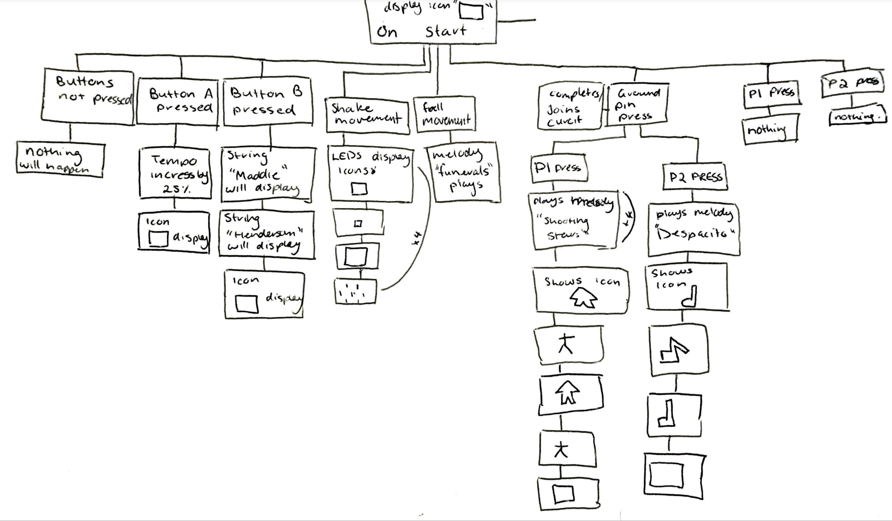
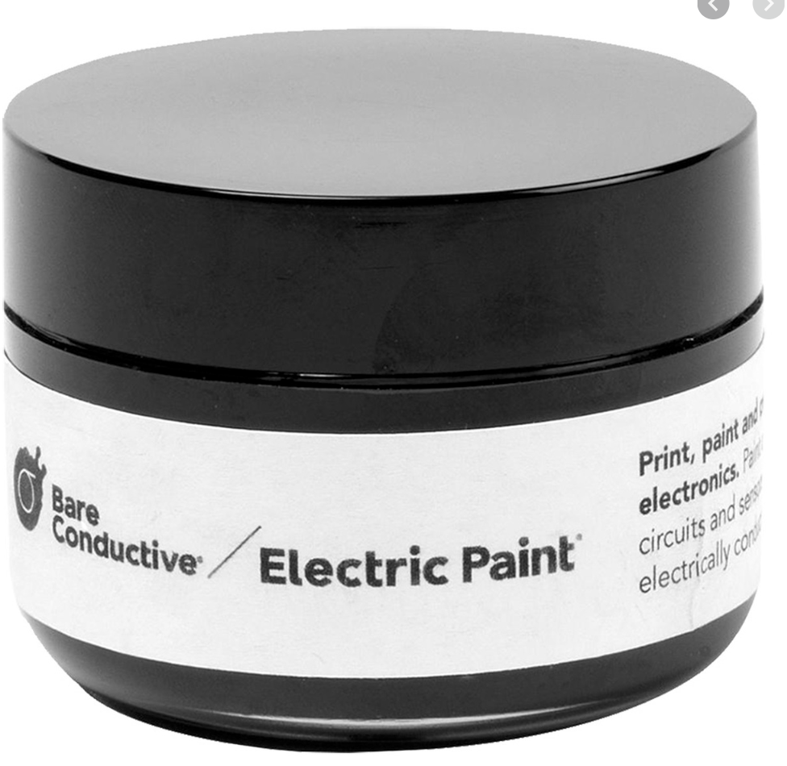
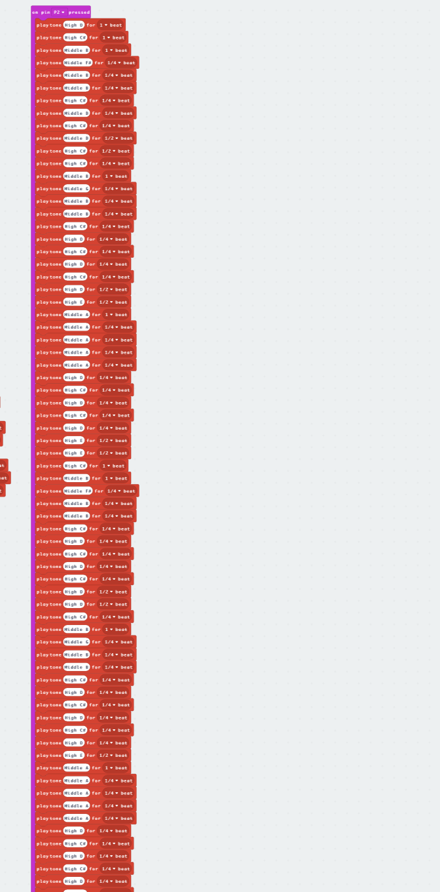

## Party T-shirt ##

Madeleine Henderson 
s5176200
Prototype assignment 2

## Related projects: ##

### Related project 1 ###
Illuminated Apparel 

https://www.youtube.com/watch?v=SJxW6BZEfkE  

This brand has created an interactive glow in the dark shirt. This shirt is drawn on with a special digital pen that has a glow output. This project relates to mine, as this shirt is designed to be used in party scenes or in the dark. 

How does this relate/ help with my project? 

-	The use of light really helps portray that party vibe
-	Light sequences – potentially customisable 
-	These shirts are machine washable – how can I make my shirt like this? 
-	Simple t-shirt designs.

### Related project 2 ###
ZEROi : Smart Hat with Bone Conduction Technology 

https://www.kickstarter.com/projects/781010162/cap-on-sound-on  

This hat uses bone conducting technology to replace the use of earphones and make day to day life more simplified with a hat that plays your music, does phone calls etc. This is all built into a waterproof cap. This project relates to mine as it is using a common piece of clothing and gives it another add on purpose. 

How does this relate/ help with my project? 

-	Simple design 
-	Waterproof -will this be something I need to consider with my design? 
-	Built in invisible components – can achieve this in my design with multiple layers 
-	 Sound close to ears – consider position of the speaker 
-	Works through bone conduction technology – could this be something to consider? 
-	The downside to this hat is that it is extremely expensive and only comes in limited styles. 
-	This hat is also chargeable but does have a small battery life – consider battery life with design.

### Related project 3 ###
Blinky shoes 

https://www.kickstarter.com/projects/1161431643/blinkyshoes 

This product allows for attachable led light strips that use an accelerometer to light up whatever part of your foot hits the ground. The more movement means the more vigorous the lights will flash. 

  How does this relate/ help with my project? 
  
-	Can work with all shapes and sizes of the product – consider different sized clothing 
-	Bright colours and a range of different colours really give off that party vibe
-	Uses an accelerometer- consider this or maybe other sensors?
-	How durable are the led lights – consider the lights available 
-	What sequences could be used and how and when? 

### Related project 4 ###
Smart T-shirt with heart rate monitor by AiQ

https://www.youtube.com/watch?v=45284tobm0c
 

This iteam is built into clothing to monitor and provide data on a persons heart rate. This works through connections around the shirt which are then sent to a detachable pin on the shirt which provides a bluetoon signal to send the data to a smart phone. What stood out to me with this design is how it is built into the shirt. There is very minimal wiring/ elements to make this work. What also stood to me is how the pin is detachable and practical to make washing easy etc. These are deffinity things for me to consider when design and building my project. 

 How does this relate/ help with my project? 
  
-	Can work with all shapes and sizes of the product – consider different sized clothing 
-	Bright colours and a range of different colours really give off that party vibe
-	How durable are the connectors in the shirt are they water proof?

### Related project 5 ### 
Dont Touch: Social Appropriateness of Touch Sensor Placement on Lumalive E-Textile Shirts 

https://www.youtube.com/watch?v=Is2mrD0KWjs
  

This experiment used sensors places on various parts of the shirt to determine the ideal locations for using sensors on that type of clothing/ part of the body. This is eye opening for me as it allows me to see where ideal places to put touch sensors would be. However the idea im am currently going with doesn’t involve other people touching the shirt, although this is good information to consider when designing and building my project.

### Related project 6 ### 
Flora Brake Light Backpack

https://www.youtube.com/watch?v=KwNGdAZKIr8
   

This project uses accelerometer sensors to indicate when a driver/user has stopped as well as indicating with turning signals. All of this is done with the use of accelerometer sensors that connect to led lights. This is an interesting project that I will consider during the process of building my design. What stood out to me and relates mostly to my project is the use of those sensors, they will definitely be something to incorporate into my project. 

## Other research ##
### Researching components and functions: 

Accelerometer
-	 measures acceleration range +2g to -2g
-	Works on x and y acsess 

-	Consider how I can use this in regrades to light sequences 
Could use the shake commandment to portray a fast light sequence 

Pin Sensors

Using pins ground 0,1,2 to make a closes circuit that will play different tunes 
-	User will have to press ground sensor to close circuit to allow for Pin 1 or 2 to be pressed. 
-	How will this be laid out? 
-	Could use images on the shirt to indicate sensors 

Sound out put 

Will use ground 0 and pin 1 to hook up the micro bit to a small speaker
-	How will this all be hooked up 
-	Can I do this without using a breadboard to make it less chunky and more practical

### *Brief resource name/description* ###

The micro bit projects
https://microbit.org/projects/
This sight gave me the resources I needed to be able to create this project with a micro bit. I looked at projects relating to the accelerometer sensor as well as touch sensor projects. These allowed me to be more confident I know what to do and how to go about doing it. I also found information on the sight that gave me in sight into how these functions work which was also insightful.

## Conceptual progress ##

 I firstly began with my intent and from there came up with so project concepts, which lead me to the final idea of a party shirt. I came to this conclusion by comparing my ideas and going through the process of elimination. I choose the party shirt as I found it the most realistic and practical item, as well as it still be very interactive for users and the people around them. I considered factors such as comfort, wearability, sustainability, function, intended audience and how well it related to the intent. From considering all those options I found the party shirt to be the most effective and suited project. 

### Design intent ###

To create a wearable party. 

### Design concept 1 ###
1.	A fun party hat. 
This would include a disco ball attached to the top of the hat. The micro bit will create light up sequences and basically turn the hat into all the lighting equipment needed for a party, as well at making the person wear it look goofy and give everyone a bit of a laugh. 

notes:
- is it practical? 
- water proof? 
- would this work with a range of diffrent hat types?

### Design concept 2 ###
2.	Arm bands that light up with particular movements. 
Using LED lights and accelerometer sensors to make the dance floor and baisc movments more fun and interactive. 

notes:
- is this aesthetically pleasing, would it work with peoples fashion taste and outfits?
- dont thing this would really work with the amount of arm movments a person makes especially on a dance floor. 
- the diffrent light patterns wouldnt be clear and would constantly look like flashion lights no matter what the type of movement.

### Design concept 3 ###
3.	Party shoes that play different tunes depending on the type of moment. 
This would work by using accelerometers to retermin the type of movemnt and play a specific tune/ melody.

notes:
- again would this work with the amount of movemnt made especially on a dance floor.
- would this just get really annoying?
- how would this look aesthetically?
- what shoes would this work with? 

### Design concept sketches ###
  

### Final design concept ###
4.	A shirt that plays different songs and lights up with different movements.

From all these concepts I decided that #4 is what I will create and further investigate into. I chose this concept as I felt that it suited and intent the best and was the most practical. The shirt idea means that it can be targeted at any gender, age etc, and it a practical and comfortable piece of clothing that people would usually wear to a party environment. This concept is also very doable considering having access to all the materials needed, as well as having a lot of potential to further develop. This concept will allow not only the person wearing this piece, to be able to interact and engage, but also the people around them. 

Does this project reflect the intent? 

 Yes, this project has achieved the idea of a “wearable party” allowing for the user to be able to engage with party music and interact with the shirt wherever they go. 

# How it will work:

The person wearing the shirt will have multiple options to interact with different functions. If they touch the play button and either one of the other symbols, a melody will play out through the speaker on their back. A range of symbols will also flash on the micro bit. If the person presses button A, the tempo will speed up when playing one of the melodies (this can then be turned off with the reset button on the micro bit). If button B is pressed the micro bit will display any text coded into the micro bit (in this case “maddie Henderson.” If the person wearing the shirt falls over a sad melody will play. If the person is dancing the micro bit will flash a range of different icons.

# materials to be used:
Aluminium, electric paint, 2x t-shirts, crocodile clips, micro bit, tape, Velcro strips, a mini speaker.

# Aesthetic: 
This product will maintain a very simple/ minimal design. It will be very contrasting and will stand out as a statement with a diverse range of symbols located around the shirt. It will look very different and unique in that sense.

### Interaction flowchart ###
*Draw a draft flowchart of what you anticipate the interaction process in your project to be. Make sure you think about all the stages of interaction step-by-step. Also make sure that you consider actions a user might take that aren't what you intend in an ideal use case. Insert an image of it below. It might just be a photo of a hand-drawn sketch, not a carefully drawn digital diagram. It just needs to be legible.*

## Physical experimentation documentation ##

# Experimenting with materials: 

Connections: 

I first attempted to use the bread board with the male and female leads. This allowed for a more secure connection with the micro bit, but the leads were too short and were not reliable and durable enough to stay attached to the pinpoints. By using these leads with the bread board, it, meant that the shirt would be weighed down and very uncomfortable and unpractical.

 

I then tried using crocodile clips. These connectors allowed me to have more length, a secure connection to the pinpoints, and meant that I did not have to use the bread board, which will make the shirt a lot more wearable and comfortable. The main concern I had with these connectors is connecting them all securely to the micro bit, as I found you had to be very particular about where you placed them. From experimenting with this issue, I found that I could use a material like tape to secure these in place.  This made the connections secure as well as water resistant. 

Sound: 

Earphones

I first experimented with earphones, these were easy enough to connect and the cord length wasn’t too excessively long. Although I found the placement of the earphones and this design was a little awkward. One piece would be longer then the other and I also found that the sound output was not ideal. The sound was a little quieter out of the earphones when It was around the neck, but way to loud when placed in ears. 

speaker

I then tried a small speaker that was a lot better with the intended design. I gave an okay sound output and wasn’t going to be annoying when wearing the shirt. The only issue I found was the length of the cord, which I was able to resolve by using tape again. 

Conductors:

Aluminium

I initially experimented with this material, it worked well, but it is not sustainable and practical for this project. 

Electrical paint

This material is a black paint that is electrically conductive. This allows the connection to work through the shirt and it is a lot more sustainable and practical. 

# Coding experimentation: 

When playing around with the coding I first looking at creating the music. I did some investigating into song that have been created through tones on a micro bit and was able to find a few videos. 

https://www.youtube.com/watch?v=eGNZXILCjyo 
https://www.youtube.com/watch?v=OSiVhUzqNAU 

I then replicated the code/ figured it out and added this into my project.

I also experimented with different button functions, I wanted to see if I could add another party element to the design. I experimented with the compass, which I didn’t find very practical to use as part of this design. I also looked into temperature which I found was very accurate for where the micro bit is positioned, as well as not be relevant to the project intent. I also look at having the micro bit record how many movements I made, but this was again inaccurate and not relevant. 

I also experimented with adjusting the tempo speed, which I found fitting for this project, adding another element to the party intent and making it more interactive.

I also experimented with icons and text, which I decided to use for button B. I added my name in as text into the micro bit, I thought this is a practical and unique function to have, as it will make the product feel more personalised, as well as being a potential safety measure for being in a party environment. The name could even be swapped out for important information in case the person wearing the shirt gets hurt etc.  
 

 
I also experimented with incorporating led lights into the design. I found this very difficult without a bread board, so I resorted to using a battery, but I forgot to place a resistor, so I fried my led lights. I found that these lights where not very effective anyways, but when finalising my project, I may see if I can find a way to still attach the lighting.  

Accelerometer. This was also something I experimented with, testing out different sounds I could incorporate with different actions. 

## Design process discussion ##
# Coding: 

Firstly, I created the coding for the Accelerometer features. Creating a “on shake” and “free fall” reaction. On shaking the micro bit, the led lights will display a pattern, rotating 4 time through 4 different images. Then of the free fall I added in a “sad” melody so that when a person wearing the shirt falls over or jumps around, the micro bit will express these actions in response and in adding more interaction. I also included an icon under “on start” I wanted to use this icon throughout the entire function of the shirt, to make it all tie together. 

Next I created the coding for the A and B button functions. For button A I created a tempo function, this allows for the user to be able to speed up the tunes playing. I made the function increase the tempo by 25%. For button B I added in the text function which I set to present my name. At the end of each command I included the square icon I had in the first section, this is to set the screen back to this defult image. 

Next I created the code for Pin 1. For this pin I wanted to create a melody of a popular and fun party song, so I replicated the tune of “shooting Stars” by Bag Raiders. This was a bit of a tedious process, but I only replicated a small portion of the key part of the song, I then put this on repeat 4 times to get the full effect of the song. I also included some star symbols that flash after the song plays, this ties into the visuals of the design, replicating the start symbol on the shirt. Lastly I again set the icon back to the default square. 

Next I created the code for Pin 2. Again, I replicated the melody of a popular party song, “Despacito” by Luis Fonsi. This was very, very tedious as I included a large part of the song, this was to give more variety in the time that a melody plays for, as well as playing enough of the song to make it recognisable to listeners. Again, I added in song note symbols at the bottom and the default square icon.

# Overview of coding: 

Insert image 

# Building the physical project

Insert image 

Firstly, I began by connecting all the cords to the conductors and the micro bit. Note that at this point in time I used aluminium foil as I had not yet received electric paint was still trialling and experimenting with materials.  

Insert image 

Next I began to secure all the connections and wires; this was to ensure that nothing would come loss and to keep everything together neatly. To do this I used white insulation tape. This keeps everything in its place, as well as keeping the connections waterproof. One area of concern I discovered in this section, was the durability of the tape over a period of time, tape isn’t the most effective and sustainable material, but improving this maybe something to look into when finalising my project. 

Insert image 

Next I attached all the components to the underlayer shirt. To do this I decided to us Velcro, as this will secure the components in place, whilst making them easily removed to be able to wash the shirt. To do this I stitched the pieces of Velcro to the shirt in the allocated places and used hot glue to attach it to the other components.   
 
Insert image 

Next I placed the top layer of the shirt over the bottom layer and mapped out where I would need to cut or paint. I then cut out a small rectangle in the top shirt, that allowed for the buttons and led lights to be visible. I also did the same on the back of the shirt for the speaker. When mapping out and matching both layers on the shirt, I lightly sketched out an outline of where the paint is to be applied. 

Insert image 

Lastly, I painted on the symbols with electric paint to both sides of the top layer shirt, to ensure the paint seeps through to allow the sensors to work. After it dried I then hooked up the shirts.  
 
Insert image 

# Over view of the project: 

## Next steps ##
 Moving forward from here I will continue to refine the project. I want to neaten up the cords and the layout on the base layer of the shirt, making it more comfortable and putting better insulation on the connections. I want to make this more sustainable and practical, as well as messing the two shirts together. I also want to see if I can find a way to incorporate some extra lights. 
